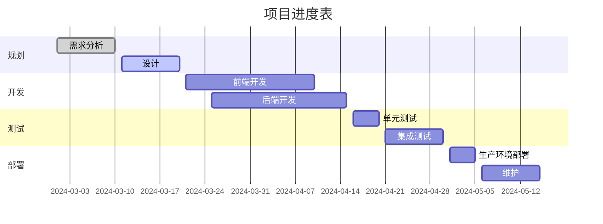
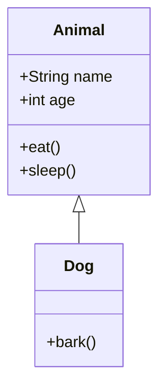

在信息爆炸的时代，枯燥的文字早已无法满足我们对数据展示的需求。NocoBase 提供的 Markdown 区块不仅可以展现文本和 HTML，还能通过 Mermaid 绘制直观、优雅的图表——让你的数据生动地"跳"起来！更令人惊喜的是，结合 Handlebars 模板变量，你可以让图表根据实时数据动态刷新，真正实现业务数据的可视化呈现。

## 一、NocoBase Markdown 区块与 vditor 字段概述

NocoBase 的 Markdown 区块一直以来被视为系统中最常用且功能强大的区块之一。它既能展示简单的文本、HTML，又能嵌入复杂的逻辑，承载业务流程和动态交互。让你在一个区块中同时享有多种扩展能力。

- **页面 Markdown 区块**：

  - 用于系统页面、弹窗和表单中展示通知、引导和提示信息。
  - 轻量灵活，适合快速展示和实时更新。
  - 支持 handlebars 模板变量
- **Markdown（vditor）字段**：

  - 功能更全面，不仅支持 Markdown 排版，还能渲染数学公式、图表、动画和其他互动效果。
  - 适用于对展示效果要求更高的场景，比如复杂的数据报表或交互式文档。

无论是哪种场景，Mermaid 图表都是你实现数据可视化的强大武器。同时 Handlebars 模板变量，或是数据表字段的灵活性，则让我们的区块动态化、智能化。

---

## 二、Mermaid 图表：让你的数据有声有色

Mermaid 是一种基于文本的图表绘制工具，支持多种图表类型。下面我们分别介绍几种常用图表，并展示如何在 Markdown 中应用它们。

### 2.1 流程图（Flowchart）

用简单的语法描述业务流程，展示各步骤之间的关系。


**应用场景**：用于展示项目开发、业务流程、操作步骤等。
**扩展**：结合 Handlebars 模板变量，可以动态设置节点名称，例如：

假设我们需要一个商机转化的示意图，我们可以使用 handlebars 模板变量来动态设置节点名称。
假设业务数据如下：
其中张三是线索数据，account 是联系人（多对一），opportunity是商机信息（多对一）。

```json
{
  "name": "张三",
  "phone": "13800138000",
  "company": "北京公司",
  "industry": "IT",
  "account": {
    "name": "李四",
    "industry": "IT"
  },
  "opportunity": {
    "stage": "Nurturing",
    "status": "Transferred"
  }
}
```

在某个弹窗或者表单中，我们使用 handlebars 模板变量来动态设置节点名称。

```mermaid
graph LR
    U[Unqualified<br/>Name: {{$nRecord.name}}<br/>Phone: {{$nRecord.phone}}]
    N[New<br/>Company: {{$nRecord.company}}<br/>Industry: {{$nRecord.industry}}]
    W[Working<br/>Account Manager: {{$nRecord.account.name}}<br/>Industry: {{$nRecord.account.industry}}]
    T[Nurturing/Transferred<br/>Opportunity Stage: {{$nRecord.opportunity.stage}}<br/>Status: {{$nRecord.status}}]

    U --> N
    N --> W
    W --> T
```


> 注意：对于变量中包含特殊字符的（比如邮箱的@符号，双引号等等），可能会报错。可根据场景灵活采用html的方案来替代。

### 2.2 时序图（Sequence Diagram）

展示多个对象或角色之间的交互过程，直观呈现消息传递的顺序。

```mermaid
sequenceDiagram
sequenceDiagram
    participant 用户 as 用户
    participant 前端 as 前端系统
    participant 后端 as 后端服务
    participant 数据库 as 数据库

    用户->>前端: 访问页面
    前端->>后端: 请求数据
    后端->>数据库: 查询数据
    数据库-->>后端: 返回查询结果
    后端-->>前端: 返回数据
    前端-->>用户: 展示数据
```

**应用场景**：适用于接口调用、系统交互流程、业务处理过程等。

### 2.3 甘特图（Gantt Diagram）

用于项目进度管理，展示任务之间的时间安排和依赖关系。




**应用场景**：适用于项目管理、生产计划、活动安排等公告内容。

### 2.4 类图（Class Diagram）

用来展示系统中各对象之间的关系及属性，适合描述面向对象设计结构。



**应用场景**：展示系统模块、对象关系、类结构等。

按照上面的数据，我们绘制一个线索和联系人、商机关联的动态类图：

```mermaid
classDiagram
    class Lead {
      +String name  [{{$nRecord.name}} ]
      +String phone  [{{$nRecord.phone}} ]
      +String company  [{{$nRecord.company}} ]
      +String industry  [{{$nRecord.industry}} ]
    }
    class Account {
      +String name  [{{$nRecord.account.name}} ]
      +String industry  [{{$nRecord.account.industry}} ]
    }
    class Opportunity {
      +String stage  [{{$nRecord.opportunity.stage}} ]
      +String status  [{{$nRecord.opportunity.status}} ]  
    }
    Lead <|-- Account
    Account <|-- Opportunity
```


---

## 三、更强大的字段：Vditor 字段

Vditor 作为 NocoBase 中的高级 Markdown 编辑器字段，提供了比普通 Markdown 更丰富的功能和表现力。除了支持基本的 Markdown 语法和 Mermaid 图表外，它还具备更多高级特性，让您的内容展示更加生动和专业。

### 3.1 高级代码块

您可以在三个反引号后指定编程语言以启用语法高亮。例如：

#### Go 代码示例

```go
package main

import "fmt"

func main() {
    fmt.Println("Hello, world!")
}
```

#### Java 代码示例

```java
public class HelloWorld {
    public static void main(String[] args) {
        System.out.println("Hello, world!");
    }
}
```

*提示：支持的语言标识符包括 `ruby`、`python`、`js`、`html`、`css`、`bash`、`json` 等多种语言。*


### 3.2 使用 ECharts 嵌入交互式图表

您可以使用 ECharts JSON 配置来包含交互式图表：

```echarts
{
  "title": { "text": "30天活动统计" },
  "tooltip": { "trigger": "axis" },
  "legend": { "data": ["帖子", "用户", "回复"] },
  "xAxis": [{
    "type": "category",
    "data": ["第1天", "第2天", "第3天", "第4天", "第5天"]
  }],
  "yAxis": [{
    "type": "value"
  }],
  "series": [
    {
      "name": "帖子",
      "type": "line",
      "data": [15, 20, 10, 25, 30]
    },
    {
      "name": "用户",
      "type": "line",
      "data": [50, 40, 60, 70, 80]
    },
    {
      "name": "回复",
      "type": "line",
      "data": [5, 8, 6, 10, 12]
    }
  ]
}
```

```echarts
{
  "title": { "text": "月度销售数据" },
  "tooltip": { "trigger": "axis" },
  "legend": { "data": ["销售额", "目标"] },
  "xAxis": [{
    "type": "category",
    "data": ["1月", "2月", "3月", "4月", "5月", "6月"]
  }],
  "yAxis": [{
    "type": "value"
  }],
  "series": [
    {
      "name": "销售额",
      "type": "bar",
      "data": [120, 200, 150, 80, 70, 110]
    },
    {
      "name": "目标",
      "type": "bar",
      "data": [100, 180, 130, 90, 60, 100]
    }
  ]
}
```


### 3.3 数学公式

Vditor 支持使用 LaTeX 语法编写行内和块级数学公式。

#### 块级公式

$$
\int_{a}^{b} f(x) \,dx = F(b) - F(a)
$$

#### 行内公式

二次方程的解由公式给出 \($x = \frac{-b \pm \sqrt{b^2 - 4ac}}{2a}$)

> 注意：公式渲染故障排查：**
>
> * **分隔符使用：** 验证您使用了正确的分隔符（块级公式使用 `$$`，行内公式使用 `\(...\)` 或 `$...$`）。
> * **浏览器兼容性：** 某些浏览器可能需要额外配置或字体才能正确显示数学公式。


### 3.4 思维导图

Vditor 支持使用专用语法直接创建思维导图。以下是一个高级示例：

```mindmap
- 高级教程
  - 代码块
    - 语法高亮
    - 语言支持
  - 图表
    - Mermaid 流程图
    - 甘特图
  - 图表
    - ECharts 集成
  - 数学
    - 行内公式
    - 块级方程
  - 多媒体
    - 视频嵌入
    - 音频文件
  - 高级可视化
    - 思维导图
    - 五线谱
```


### 3.5 五线谱（音乐符号）

Vditor 还支持渲染五线谱。以下是使用 ABC 符号的示例：

```abc
X: 24
T: Clouds Thicken
C: Paul Rosen
S: Copyright 2005, Paul Rosen
M: 6/8
L: 1/8
Q: 3/8=116
R: Creepy Jig
K: Em
|:"Em"EEE E2G|"C7"_B2A G2F|"Em"EEE E2G|\
"C7"_B2A "B7"=B3|"Em"EEE E2G|
"C7"_B2A G2F|"Em"GFE "D (Bm7)"F2D|\
1"Em"E3-E3:|2"Em"E3-E2B|:"Em"e2e gfe|
"G"g2ab3|"Em"gfeg2e|"D"fedB2A|"Em"e2e gfe|\
"G"g2ab3|"Em"gfe"D"f2d|"Em"e3-e3:|
```


### 3.6 多媒体嵌入

Vditor 支持嵌入视频和音频等多媒体内容。只需粘贴 URL，Vditor 会将其解析为交互式播放器。

示例（页面中直接输入地址即可）：

https://www.youtube.com/watch?v=9YzDdchEeGs&list=PLYazx7O6V_fSFkw_e2PY1vzcevaltlNAp&index=6


### 3.7 结合业务场景应用

在 NocoBase 业务场景中，Vditor 字段可以灵活应用于：

- **知识库管理**：创建包含代码示例、数学公式和图表的技术文档
- **产品说明书**：使用思维导图和多媒体内容展示产品特性
- **销售报告**：通过 ECharts 图表直观展示销售数据和趋势
- **培训材料**：结合代码块、图表和多媒体创建互动式学习内容

动态结合 Handlebars 模板变量，可以根据实际业务数据自动生成相应的内容，提高文档的实用性和时效性。

---

## 总结与展望

Markdown 区块与 Markdown（vditor）字段为业务展示带来了更多的可能性：

- **基础 Mermaid 支持**：无论是页面公告还是技术文档，都能通过简单的代码生成各类图表。
- **动态模板变量**：结合 Handlebars，你可以实现个性化、实时更新的数据展示，无论订单状态、项目进度还是任务列表，都能准确反映业务情况。
- **扩展能力**：vditor 字段支持更多扩展功能，为你的文档提供数学公式、代码高亮、动画等多种表现形式，使展示内容既专业又富有创意。

通过本文的讲解，相信你已对 Markdown 与 Mermaid 的使用有了全新的认识。无论你是设计一份业务公告、创建项目看板还是构建数据报表，都能利用这些工具将枯燥的数据转化为生动的视觉盛宴。快来动手试试，让数据在你的指尖跳跃起来吧！
