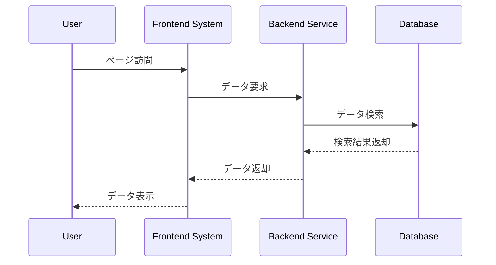
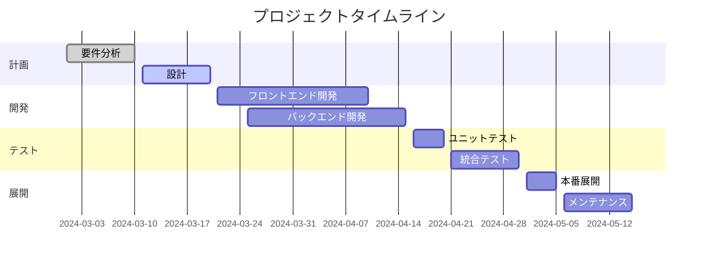
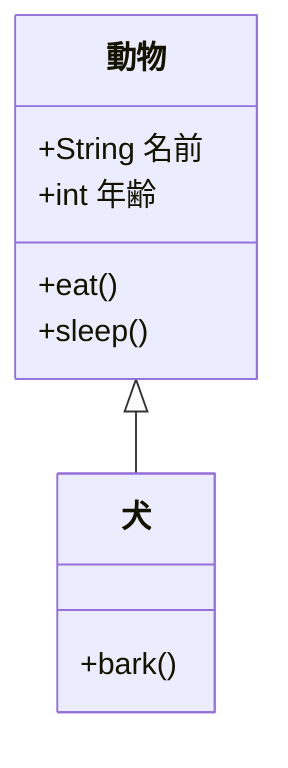

情報爆発の時代において、単調なテキストだけではデータ提示のニーズを満たせません。NocoBaseが提供するMarkdownブロックは、テキストやHTMLの表示に加え、Mermaidを用いて直感的で洗練されたチャートを描画し、データに命を吹き込みます！さらに、Handlebarsテンプレート変数を組み合わせることで、リアルタイムデータに基づいた動的なチャート更新が可能となり、ビジネスデータを真に可視化します。

## 1. NocoBaseのMarkdownブロックとVditorフィールドの概要

NocoBaseのMarkdownブロックは、システム内で最も一般的かつ強力なブロックの一つとされ、シンプルなテキストやHTMLの表示はもちろん、複雑なロジックを組み込んでビジネスプロセスや動的なインタラクションをサポートできます。これにより、一つのブロック内で多彩な機能を楽しむことができます。

- **ページMarkdownブロック**:

  - システムページ、ポップアップ、フォームで通知、ガイダンス、ヒントの表示に利用されます。
  - 軽量かつ柔軟で、迅速な表示やリアルタイム更新に適しています。
  - Handlebarsテンプレート変数に対応。
- **Markdown (Vditor)フィールド**:

  - Markdown記法のサポートに加え、数学の数式、チャート、アニメーションなどのインタラクティブな効果が描画できる、より包括的な機能を提供します。
  - 複雑なデータレポートやインタラクティブな文書など、高品質な表示が求められるシーンに最適です。

いかなるシーンにおいても、Mermaidチャートはデータ可視化の強力なツールです。さらに、Handlebarsテンプレート変数とデータフィールドの柔軟性により、ブロックは動的かつインテリジェントになります。
---------------------------------------------------------------------------------------------------------------------------------------------------------------------------------------------

## 2. Mermaidチャート：データに命を吹き込む

Mermaidはテキストベースのチャート描画ツールで、様々な種類のチャートをサポートしています。以下に、よく利用されるチャートのいくつかを紹介し、Markdownでの実装方法を説明します。

### 2.1 フローチャート

フローチャートは、シンプルな構文でビジネスプロセスを記述し、各ステップ間の関係を図示します。graph LR
A[プロジェクト開始] --> B[要求計画]
B --> C[プロトタイプ設計]
C --> D[実装開発]
D --> E[テストとデプロイ]

```

**適用シーン**: プロジェクト開発、ビジネスプロセス、業務手順などの図示に利用されます。  
**拡張**: Handlebarsテンプレート変数を組み合わせることで、ノードの名称を動的に設定できます。例えば：

ビジネスチャンスの転換を図示する場合、以下のビジネスデータを基にHandlebarsテンプレート変数を使用してノード名称を動的に設定します。ここで、「Zhang San」はリードデータを示し、「account」は連絡先（多対一）、「opportunity」はビジネスチャンス情報（多対一）を含みます.
```json
{
  "name": "Zhang San",
  "phone": "13800138000",
  "company": "Beijing Company",
  "industry": "IT",
  "account": {
    "name": "Li Si",
    "industry": "IT"
  },
  "opportunity": {
    "stage": "Nurturing",
    "status": "Transferred"
  }
}
```

ポップアップやフォームでは、Handlebarsテンプレート変数を使用してノードの名称を動的に設定します.

```mermaid
graph LR
    U[非適格<br/>Name: {{$nRecord.name}}<br/>Phone: {{$nRecord.phone}}]
    N[新規<br/>Company: {{$nRecord.company}}<br/>Industry: {{$nRecord.industry}}]
    W[対応中<br/>Account Manager: {{$nRecord.account.name}}<br/>Industry: {{$nRecord.account.industry}}]
    T[育成中/転送済み<br/>Opportunity Stage: {{$nRecord.opportunity.stage}}<br/>Status: {{$nRecord.status}}]

    U --> N
    N --> W
    W --> T
```


> ※注意: 変数がメールアドレスの@記号や引用符などの特殊文字を含む場合、エラーが発生することがあります。状況に応じて、HTMLソリューションを柔軟に使用してください。

### 2.2 シーケンス図

この図は、複数のオブジェクトや役割間の相互作用プロセスを示し、メッセージの送受信順序を明確に表現します。



**適用シーン**: API呼び出し、システム間のインタラクションフロー、ビジネスプロセスのシーケンスなどの図示に適しています。

### 2.3 ガントチャート

プロジェクトスケジュール管理に使用されるこのチャートは、各タスクのタイミングと依存関係を示します。




**適用シーン**: プロジェクト管理、生産計画、イベントスケジューリングなどに理想的です。

### 2.4 クラス図

クラス図は、システム内の各オブジェクト間の関係や属性を表示し、オブジェクト指向デザインの構造を説明するのに最適です。



**適用シーン**: システムモジュール、オブジェクト間の関係、クラス構造などの説明に利用されます。

上記のデータに基づき、リード、連絡先、ビジネスチャンスを連結する動的なクラス図を作成します:

```mermaid
classDiagram
    class Lead {
      +String name  [{{$nRecord.name}} ]
      +String phone  [{{$nRecord.phone}} ]
      +String company  [{{$nRecord.company}} ]
      +String industry  [{{$nRecord.industry}} ]
    }
    class Account {
      +String name  [{{$nRecord.account.name}} ]
      +String industry  [{{$nRecord.account.industry}} ]
    }
    class Opportunity {
      +String stage  [{{$nRecord.opportunity.stage}} ]
      +String status  [{{$nRecord.opportunity.status}} ]  
    }
    Lead <|-- Account
    Account <|-- Opportunity
```


------------------------------------------------------------------

## 3. より多機能なフィールド：Vditorフィールド

NocoBaseの高機能MarkdownエディタフィールドであるVditorは、標準のMarkdownよりも豊富な機能と表現力を提供します。基本的なMarkdown記法やMermaidチャートのサポートに加え、数式、構文ハイライト、アニメーションなど、多くの高度な機能を備えており、コンテンツのプレゼンテーションをよりダイナミックかつプロフェッショナルなものにします。

### 3.1 高度なコードブロック

三つのバックティックの後にプログラミング言語を指定することで、構文ハイライトを有効にできます。例：

#### Go言語のコード例

```go
package main

import "fmt"

func main() {
    fmt.Println("Hello, world!")
}
```

#### Java言語のコード例

```java
public class HelloWorld {
    public static void main(String[] args) {
        System.out.println("Hello, world!");
    }
}
```

*ヒント: サポートされる言語識別子には、`ruby`、`python`、`js`、`html`、`css`、`bash`、`json`など多数が含まれます。*


### 3.2 EChartsを用いたインタラクティブチャートの埋め込み

EChartsのJSON設定を使用して、インタラクティブなチャートを埋め込むことができます：

```echarts
{
  "title": { "text": "30日間の活動統計" },
  "tooltip": { "trigger": "axis" },
  "legend": { "data": ["投稿", "ユーザー", "返信"] },
  "xAxis": [{
    "type": "category",
    "data": ["1日目", "2日目", "3日目", "4日目", "5日目"]
  }],
  "yAxis": [{
    "type": "value"
  }],
  "series": [
    {
      "name": "投稿",
      "type": "line",
      "data": [15, 20, 10, 25, 30]
    },
    {
      "name": "ユーザー",
      "type": "line",
      "data": [50, 40, 60, 70, 80]
    },
    {
      "name": "返信",
      "type": "line",
      "data": [5, 8, 6, 10, 12]
    }
  ]
}
```

```echarts
{
  "title": { "text": "月間売上データ" },
  "tooltip": { "trigger": "axis" },
  "legend": { "data": ["売上", "目標"] },
  "xAxis": [{
    "type": "category",
    "data": ["1月", "2月", "3月", "4月", "5月", "6月"]
  }],
  "yAxis": [{
    "type": "value"
  }],
  "series": [
    {
      "name": "売上",
      "type": "bar",
      "data": [120, 200, 150, 80, 70, 110]
    },
    {
      "name": "目標",
      "type": "bar",
      "data": [100, 180, 130, 90, 60, 100]
    }
  ]
}
```


### 3.3 数式

VditorはLaTeX記法を用いて、インラインおよびブロックレベルの数式の描画をサポートします。

#### ブロック数式

$$
\int_{a}^{b} f(x) \,dx = F(b) - F(a)
$$

#### インライン数式

二次方程式の解は \($x = \frac{-b \pm \sqrt{b^2 - 4ac}}{2a}$) と示されます。

> ※注意: 数式レンダリングのトラブルシューティング:
>
> * **区切り文字の使用:** ブロック数式は `$$`、インライン数式は `\(...\)` または `$...$` の正しい区切り文字を使用していることを確認してください。
> * **ブラウザの互換性:** 一部のブラウザでは、数式を正しく表示するために追加の設定やフォントが必要な場合があります。


### 3.4 マインドマップ

Vditorは専用の構文を用いて直接マインドマップを作成することをサポートします。以下は高度な例です：

```mindmap
- 上級チュートリアル
  - コードブロック
    - 構文ハイライト
    - 言語サポート
  - チャート
    - Mermaidフローチャート
    - ガントチャート
  - チャート
    - ECharts統合
  - 数式
    - インライン数式
    - ブロック数式
  - マルチメディア
    - ビデオ埋め込み
    - 音声ファイル
  - 高度な可視化
    - マインドマップ
    - 譜面表記
```


### 3.5 譜面表記 (楽譜記号)

Vditorは譜面表記のレンダリングもサポートしています。以下はABC記法を用いた例です：

```abc
X: 24
T: Clouds Thicken
C: Paul Rosen
S: Copyright 2005, Paul Rosen
M: 6/8
L: 1/8
Q: 3/8=116
R: Creepy Jig
K: Em
|:"Em"EEE E2G|"C7"_B2A G2F|"Em"EEE E2G|\
"C7"_B2A "B7"=B3|"Em"EEE E2G|
"C7"_B2A G2F|"Em"GFE "D (Bm7)"F2D|\
1"Em"E3-E3:|2"Em"E3-E2B|:"Em"e2e gfe|
"G"g2ab3|"Em"gfeg2e|"D"fedB2A|"Em"e2e gfe|\
"G"g2ab3|"Em"gfe"D"f2d|"Em"e3-e3:|
```


### 3.6 マルチメディア埋め込み

Vditorは、ビデオや音声などのマルチメディアコンテンツの埋め込みをサポートしています。URLを貼り付けるだけで、Vditorがインタラクティブなプレーヤーに変換します。

例（ページ上に直接URLを入力）:

https://www.youtube.com/watch?v=9YzDdchEeGs&list=PLYazx7O6V_fSFkw_e2PY1vzcevaltlNAp&index=6


### 3.7 ビジネスシーンでの応用

NocoBaseのビジネスシーンでは、Vditorフィールドを柔軟に以下の用途に活用できます：

- **ナレッジベース管理**: コード例、数式、チャートを含む技術文書の作成。
- **製品マニュアル**: マインドマップやマルチメディアコンテンツを用いて製品特徴を紹介。
- **売上レポート**: EChartsチャートを活用して売上データやトレンドを視覚的に提示。
- **トレーニング資料**: コードブロック、チャート、マルチメディアを組み合わせて、インタラクティブな学習コンテンツを作成。

Handlebarsテンプレート変数を動的に取り入れることで、実際のビジネスデータに基づいたコンテンツの自動生成が可能となり、文書の実用性と時宜性が向上します。
------------------------------------------------------------------------------------------------------------------------------------------------------

## まとめと展望

MarkdownブロックおよびMarkdown (Vditor)フィールドは、ビジネスプレゼンテーションに無限の可能性を提供します：

- **基本的なMermaidサポート**: ページのお知らせや技術文書で、シンプルなコードによって様々なチャートが生成可能です。
- **動的テンプレート変数**: Handlebarsを利用することで、注文状況、プロジェクト進捗、タスクリストなどを正確に反映した、パーソナライズかつリアルタイムなデータ表示が実現できます。
- **拡張性**: Vditorフィールドは、数式、構文ハイライト、アニメーションなど追加機能をサポートし、文書をプロフェッショナルで創造的なものに仕上げます。

この記事を通して、NocoBaseにおけるMarkdownおよびMermaidの活用方法への新たな理解が得られたことと思います。ビジネスのお知らせの設計、プロジェクトダッシュボードの作成、またはデータレポートの構築など、これらのツールは単調なデータを鮮やかなビジュアルの饗宴へと変える力を持っています。ぜひお試しください、そしてあなたのデータに手元で躍動感を！
