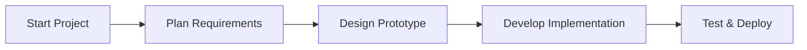
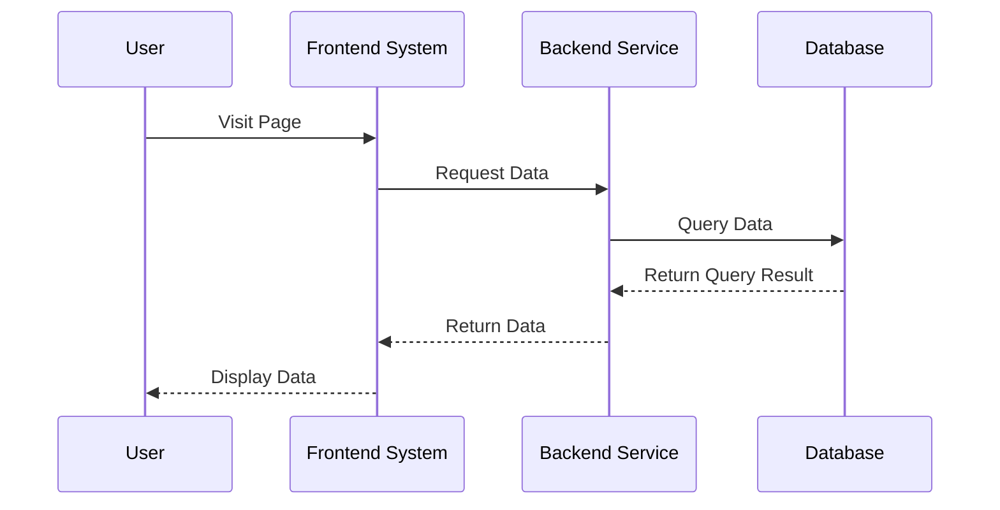
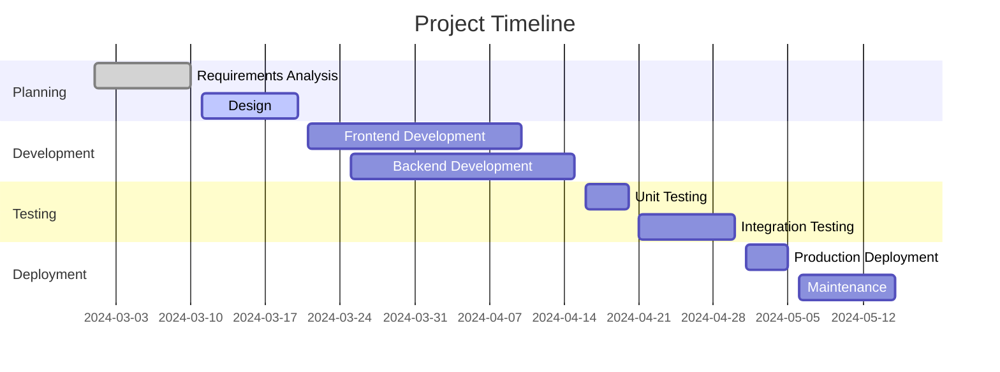
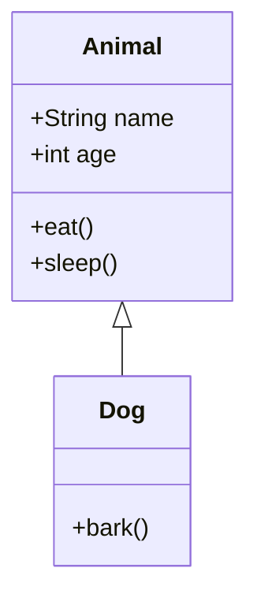

In the era of information explosion, dull text no longer satisfies our needs for data presentation. The Markdown block provided by NocoBasenot only displays text and HTML but also renders intuitive and elegant charts using Mermaid—bringing your data to life! Even more exciting, by combining Handlebars template variables, you can have the charts dynamically refresh based on real-time data, truly visualizing your business data.

## 1. Overview of NocoBase Markdown Blocks and Vditor Fields

NocoBase's Markdown block has long been regarded as one of the most commonly used and powerful blocks in the system. It can display simple text and HTML, as well as embed complex logic to support business processes and dynamic interactions. This allows you to enjoy multiple functionalities within a single block.

- **Page Markdown Block**:

  - Used on system pages, pop-ups, and forms to display notifications, guidance, and tips.
  - Lightweight and flexible, suitable for quick display and real-time updates.
  - Supports Handlebars template variables.
- **Markdown (Vditor) Field**:

  - Offers a more comprehensive feature set; in addition to supporting Markdown formatting, it can render mathematical formulas, charts, animations, and other interactive effects.
  - Ideal for scenarios that demand a higher quality of display, such as complex data reports or interactive documents.

No matter the scenario, Mermaid charts are a powerful tool for data visualization. Moreover, the flexibility of Handlebars template variables and data fields makes our blocks dynamic and intelligent.

---

## 2. Mermaid Charts: Bringing Your Data to Life

Mermaid is a text-based chart drawing tool that supports various types of charts. Below, we introduce several commonly used charts and demonstrate how to implement them in Markdown.

### 2.1 Flowchart

A flowchart uses simple syntax to describe a business process, illustrating the relationships between steps.



**Application Scenario**: Used to illustrate project development, business processes, operational steps, and more.
**Extension**: By combining Handlebars template variables, node names can be set dynamically. For example:

Suppose we need an illustration for business opportunity conversion. We can use Handlebars template variables to dynamically set node names. Consider the following business data:
Here, "Zhang San" represents the lead data, "account" is the contact (many-to-one), and "opportunity" contains the business opportunity information (many-to-one).

```json
{
  "name": "Zhang San",
  "phone": "13800138000",
  "company": "Beijing Company",
  "industry": "IT",
  "account": {
    "name": "Li Si",
    "industry": "IT"
  },
  "opportunity": {
    "stage": "Nurturing",
    "status": "Transferred"
  }
}
```

In a popup or form, we use Handlebars template variables to dynamically set the node names.

```mermaid
graph LR
    U[Unqualified<br/>Name: {{$nRecord.name}}<br/>Phone: {{$nRecord.phone}}]
    N[New<br/>Company: {{$nRecord.company}}<br/>Industry: {{$nRecord.industry}}]
    W[Working<br/>Account Manager: {{$nRecord.account.name}}<br/>Industry: {{$nRecord.account.industry}}]
    T[Nurturing/Transferred<br/>Opportunity Stage: {{$nRecord.opportunity.stage}}<br/>Status: {{$nRecord.status}}]

    U --> N
    N --> W
    W --> T
```


> NOTE: For variables containing special characters (such as the @ symbol in emails, quotation marks, etc.), errors may occur. You can flexibly opt for an HTML solution based on the situation.

### 2.2 Sequence Diagram

This diagram displays the interaction process between multiple objects or roles, clearly showing the order of message passing.



**Application Scenario**: Suitable for illustrating API calls, system interaction flows, business processing sequences, etc.

### 2.3 Gantt Diagram

Used for project schedule management, this diagram shows the timing and dependencies of various tasks.




**Application Scenario**: Ideal for project management, production planning, event scheduling, and similar contexts.

### 2.4 Class Diagram

A class diagram is used to display the relationships and attributes among various objects in a system, making it ideal for describing object-oriented design structures.



**Application Scenario**: Demonstrates system modules, object relationships, class structures, etc.

Based on the data above, we create a dynamic class diagram linking leads, contacts, and business opportunities:

```mermaid
classDiagram
    class Lead {
      +String name  [{{$nRecord.name}} ]
      +String phone  [{{$nRecord.phone}} ]
      +String company  [{{$nRecord.company}} ]
      +String industry  [{{$nRecord.industry}} ]
    }
    class Account {
      +String name  [{{$nRecord.account.name}} ]
      +String industry  [{{$nRecord.account.industry}} ]
    }
    class Opportunity {
      +String stage  [{{$nRecord.opportunity.stage}} ]
      +String status  [{{$nRecord.opportunity.status}} ]  
    }
    Lead <|-- Account
    Account <|-- Opportunity
```


---

## 3. More Powerful Fields: Vditor Fields

As a high-level Markdown editor field in NocoBase, Vditor provides richer functionality and expressiveness than standard Markdown. Beyond supporting basic Markdown syntax and Mermaid charts, it also offers many advanced features that make your content presentation more dynamic and professional.

### 3.1 Advanced Code Blocks

You can specify the programming language after the three backticks to enable syntax highlighting. For example:

#### Go Code Example

```go
package main

import "fmt"

func main() {
    fmt.Println("Hello, world!")
}
```

#### Java Code Example

```java
public class HelloWorld {
    public static void main(String[] args) {
        System.out.println("Hello, world!");
    }
}
```

*Tip: Supported language identifiers include `ruby`, `python`, `js`, `html`, `css`, `bash`, `json`, and many others.*


### 3.2 Embedding Interactive Charts Using ECharts

You can include interactive charts by using an ECharts JSON configuration:

```echarts
{
  "title": { "text": "30 Days Activity Statistics" },
  "tooltip": { "trigger": "axis" },
  "legend": { "data": ["Posts", "Users", "Replies"] },
  "xAxis": [{
    "type": "category",
    "data": ["Day 1", "Day 2", "Day 3", "Day 4", "Day 5"]
  }],
  "yAxis": [{
    "type": "value"
  }],
  "series": [
    {
      "name": "Posts",
      "type": "line",
      "data": [15, 20, 10, 25, 30]
    },
    {
      "name": "Users",
      "type": "line",
      "data": [50, 40, 60, 70, 80]
    },
    {
      "name": "Replies",
      "type": "line",
      "data": [5, 8, 6, 10, 12]
    }
  ]
}
```

```echarts
{
  "title": { "text": "Monthly Sales Data" },
  "tooltip": { "trigger": "axis" },
  "legend": { "data": ["Sales", "Target"] },
  "xAxis": [{
    "type": "category",
    "data": ["January", "February", "March", "April", "May", "June"]
  }],
  "yAxis": [{
    "type": "value"
  }],
  "series": [
    {
      "name": "Sales",
      "type": "bar",
      "data": [120, 200, 150, 80, 70, 110]
    },
    {
      "name": "Target",
      "type": "bar",
      "data": [100, 180, 130, 90, 60, 100]
    }
  ]
}
```


### 3.3 Mathematical Formulas

Vditor supports the rendering of both inline and block-level mathematical formulas using LaTeX syntax.

#### Block Formula

$$
\int_{a}^{b} f(x) \,dx = F(b) - F(a)
$$

#### Inline Formula

The solution to a quadratic equation is given by \($x = \frac{-b \pm \sqrt{b^2 - 4ac}}{2a}$)

> Note: Troubleshooting formula rendering:
>
> * **Delimiter Usage:** Ensure that you are using the correct delimiters (block formulas with `$$` and inline formulas with `\(...\)` or `$...$`).
> * **Browser Compatibility:** Some browsers may require additional configuration or fonts to display mathematical formulas correctly.


### 3.4 Mind Map

Vditor supports directly creating mind maps using dedicated syntax. Here is an advanced example:

```mindmap
- Advanced Tutorial
  - Code Blocks
    - Syntax Highlighting
    - Language Support
  - Charts
    - Mermaid Flowchart
    - Gantt Chart
  - Charts
    - ECharts Integration
  - Mathematics
    - Inline Formula
    - Block Formula
  - Multimedia
    - Video Embedding
    - Audio Files
  - Advanced Visualization
    - Mind Map
    - Staff Notation
```


### 3.5 Staff Notation (Musical Symbols)

Vditor also supports rendering staff notation. The following is an example using ABC notation:

```abc
X: 24
T: Clouds Thicken
C: Paul Rosen
S: Copyright 2005, Paul Rosen
M: 6/8
L: 1/8
Q: 3/8=116
R: Creepy Jig
K: Em
|:"Em"EEE E2G|"C7"_B2A G2F|"Em"EEE E2G|\
"C7"_B2A "B7"=B3|"Em"EEE E2G|
"C7"_B2A G2F|"Em"GFE "D (Bm7)"F2D|\
1"Em"E3-E3:|2"Em"E3-E2B|:"Em"e2e gfe|
"G"g2ab3|"Em"gfeg2e|"D"fedB2A|"Em"e2e gfe|\
"G"g2ab3|"Em"gfe"D"f2d|"Em"e3-e3:|
```


### 3.6 Multimedia Embedding

Vditor supports embedding multimedia content such as videos and audio. Simply paste the URL, and Vditor will parse it into an interactive player.

Example (just enter the URL directly on the page):

https://www.youtube.com/watch?v=9YzDdchEeGs&list=PLYazx7O6V_fSFkw_e2PY1vzcevaltlNAp&index=6


### 3.7 Application in Business Scenarios

In NocoBase business scenarios, the Vditor field can be flexibly applied for:

- **Knowledge Base Management**: Creating technical documents that include code examples, mathematical formulas, and charts.
- **Product Manuals**: Using mind maps and multimedia content to showcase product features.
- **Sales Reports**: Visually presenting sales data and trends through ECharts charts.
- **Training Materials**: Combining code blocks, charts, and multimedia to create interactive learning content.

By dynamically incorporating Handlebars template variables, content can be automatically generated based on actual business data, enhancing the practicality and timeliness of your documentation.

---

## Summary and Outlook

Markdown blocks and Markdown (Vditor) fields open possibilities for business presentation:

- **Basic Mermaid Support**: Whether it's a page announcement or a technical document, various charts can be generated with simple code.
- **Dynamic Template Variables**: With Handlebars, you can achieve personalized, real-time data displays that accurately reflect order statuses, project progress, task lists, and more.
- **Extensibility**: The Vditor field supports additional features, providing your documentation with mathematical formulas, syntax highlighting, animations, and more, making the content both professional and creative.

Through this article, we believe you have gained a new understanding of how Markdown and Mermaid are used in NocoBase. Whether you're designing a business announcement, creating a project dashboard, or building a data report, these tools can transform dull data into a vivid visual feast. Give it a try and let your data jump at your fingertips!
